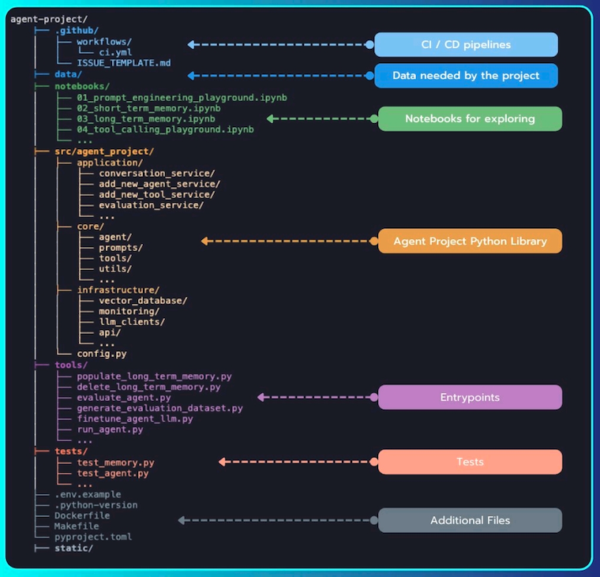

# 🧠 Agent Project Template

This project template helps scaffold a modular, production-grade AI Agent architecture.

---

## 📁 Structure Overview




---

## 🧩 Components Explained

| Folder/File                  | Purpose                             |
|------------------------------|-------------------------------------|
| `.github/workflows`          | CI/CD pipeline using GitHub Actions |
| `data/`                      | Stores input/output data            |
| `notebooks/`                 | Prototyping and prompt engineering  |
| `src/agent_project/`         | Modular source code for agents      |
| `tools/`                     | CLI scripts and entrypoints         |
| `tests/`                     | Test coverage                       |
| `.env.example`, `Dockerfile` | Setup and deployment                |

---

## 🚀 Getting Started

```bash
python create_agent_project_template.py
```
This command will generate the folder structure shown above.